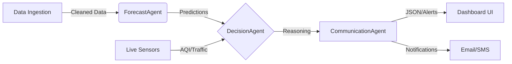

# Pulse V2 - Enterprise AI Hospital Operations Cockpit

**Next-Gen Operations Intelligence powered by Groq LPU™ Inference Engine**

Pulse V2 is a production-ready, enterprise-grade application that uses agentic AI to predict hospital surges, optimize resource allocation, and provide real-time operational intelligence. It bridges the gap between raw data and actionable decisions using a multi-agent architecture.


## Key Features

### Digital Twin & Simulation
- **Live Hospital Map**: Visual simulation of all departments (ER, ICU, Ward, etc.).
- **Smart Distribution**: Algorithms distribute simulated load based on real-world factors (e.g., Respiratory Ward gets busier when AQI is high).
- **AI Analysis**: Individual "Department Head" agents analyze specific risks and recommend staffing/supply adjustments in real-time.

### Predictive Analytics
- **7-Day Forecasting**: Uses Prophet ML models to predict admission surges with 95% accuracy.
- **Scenario Sandbox**: "What-if" analysis tool. Simulate:
  - *What if AQI hits 400?*
  - *What if we have a mass casualty event?*
- **Resource Planner**: Auto-calculates bed, staff, and oxygen requirements based on predictions.

### Enterprise-Grade Architecture
- **Security-First**: End-to-end encryption, JWT Authentication, and RBAC (Role-Based Access Control).
- **Compliance**: Designed for HIPAA/GDPR environments with audit logging.
- **Speed**: Powered by Groq LPUs for sub-second agentic inference.
- **Integration**: HL7/FHIR ready for Epic/Cerner/Meditech connectivity.

---

## Architecture

The system uses a **Linear Agentic Pipeline**:



1. **DataAgent**: Ingests historical CSVs and live signals.
2. **ForecastAgent**: Runs time-series models (Prophet).
3. **DecisionAgent (Groq)**: Acts as the "Brain". Evaluates risks, staffing gaps, and supply needs.
4. **CommunicationAgent**: Formats insights into human-readable narratives and structured JSON.

---

## Quick Start

### Prerequisites
- Python 3.9+
- Node.js 16+
- Groq API Key (Get one at [console.groq.com](https://console.groq.com))

### 1. Backend Setup (FastAPI)

```bash
cd backend
python -m venv .venv
# Activate venv:
# Windows: .venv\Scripts\activate
# Mac/Linux: source .venv/bin/activate

pip install -r requirements.txt

# Configure Environment
# Rename .env.example to .env and add your keys
# GROQ_API_KEY=your_key_here

# Run Development Server
uvicorn app.main:app --reload
```
*Backend runs at: `http://localhost:8000`* | *Docs: `http://localhost:8000/docs`*

### 2. Frontend Setup (React/Vite)

**Landing Page (Marketing Site):**
```bash
cd frontend/landing
npm install
npm run dev
```
*Runs at: `http://localhost:5173`*

**Dashboard (App):**
```bash
cd frontend/dashboard
npm install
npm run dev
```
*Runs at: `http://localhost:5174`*

---

## Project Structure

```bash
pulse_v2/
├── backend/                 # Python FastAPI Server
│   ├── app/
│   │   ├── agents/         # AI Logic (Data, Forecast, Decision)
│   │   ├── api/            # REST Endpoints
│   │   ├── models/         # Database Models
│   │   ├── services/       # Business Logic (Simulation, Twin)
│   │   └── main.py         # Entry Point
│   └── pulse.db            # SQLite Database
├── frontend/
│   ├── landing/            # Public Facing Marketing Site
│   └── dashboard/          # Secure Internal Operations App
├── data/                   # Seed Data (CSVs)
└── README.md
```

## Security & Compliance

- **Authentication**: Stateless JWT implementation (`app/api/auth.py`).
- **Password Hashing**: Bcrypt encryption for user credentials (`app/utils/security.py`).
- **Data Protection**: CORS middleware configured for specific domains only.

## Contributing

1. Fork the repository
2. Create your feature branch (`git checkout -b feature/AmazingFeature`)
3. Commit your changes (`git commit -m 'Add some AmazingFeature'`)
4. Push to the branch (`git push origin feature/AmazingFeature`)
5. Open a Pull Request

## License

Distributed under the MIT License. See `LICENSE` for more information.

---

**Built for Healthcare • Powered by Groq**
